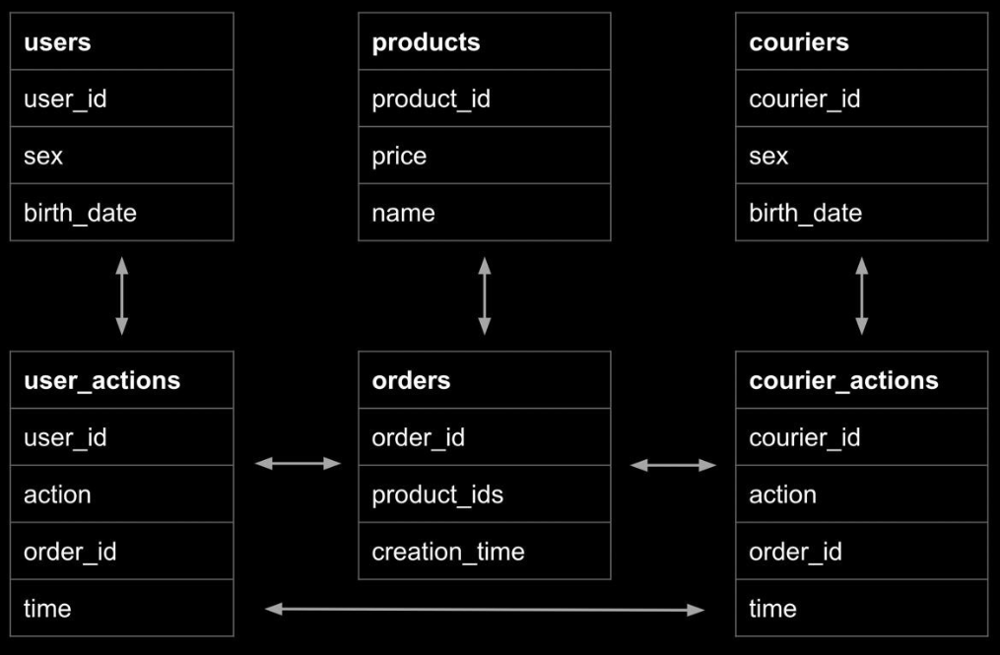

## Table Structure and Description

The database schema and description are taken from the ["SQL simulator" materials](https://lab.karpov.courses/learning/152/module/1762/lesson/17923/51794/244290/)

### The database Schema

The database schema is shown in the image below.

### Table Descriptions

**user_actions** — user interactions with orders

| Column    | Data Type    | Description                                                                     |
| :-------- | :----------: | --------------------------------------------------------------------------:     |
| user_id   | INT          | User ID                                                                         |
| order_id  | INT          | Order ID                                                                        |
| action    | VARCHAR(50)  | Action taken: `create_order` (order created) or `cancel_order` (order canceled) |
| time      | TIMESTAMP    | Timestamp of the action

**courier_actions** — courier interactions with orders

| Column       | Data Type    | Description                                                                        |
| :--------    | :----------: | --------------------------------------------------------------------------:        |
| courier_id   | INT          | Courier ID                                                                         |
| order_id     | INT          | Order ID                                                                           |
| action       | VARCHAR(50)  | Action taken: `accept_order` (order accepted) or `deliver_order` (order delivered) |
| time         | TIMESTAMP    | Timestamp of the action

**orders** — information about orders

| Column            | Data Type    | Description                                                                 |
| :--------         | :----------: | --------------------------------------------------------------------------: |
| order_id          | INT          | Order ID                                                                    |
| creation_time     | TIMESTAMP    | Timestamp of the order creation                                             |
| product_ids       | integer[]    | List of product IDs from the order                                          |

**users** — information about users

| Column           | Data Type    | Description                                                                 |
| :--------        | :----------: | --------------------------------------------------------------------------: |
| user_id          | INT          | User ID                                                                     |
| birth_date       | DATE         | User birthdate                                                              |
| sex              | VARCHAR(50)  | User's gender: `male` or `female`                                           |

**couriers** — information about couriers

| Column           | Data Type    | Description                                                                 |
| :--------        | :----------: | --------------------------------------------------------------------------: |
| courier_id       | INT          | Courier ID                                                                  |
| birth_date       | DATE         | Courier birthdate                                                           |
| sex              | VARCHAR(50)  | Couriers's gender: `male` or `female`                                       |

**products** — information about products

| Column           | Data Type    | Description                                                                 |
| :--------        | :----------: | --------------------------------------------------------------------------: |
| product_id       | INT          | Product ID                                                                  |
| name             | VARCHAR(50)  | Product name                                                                |
| price            | FLOAT(4)     | Price of product                                                            |