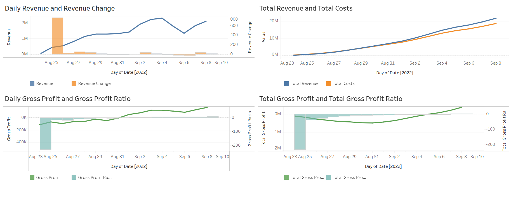
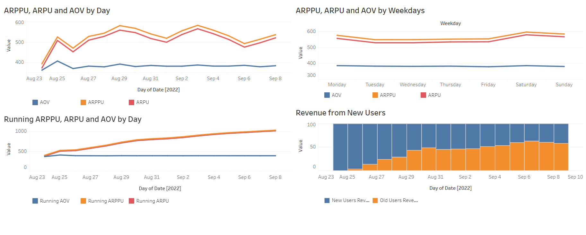
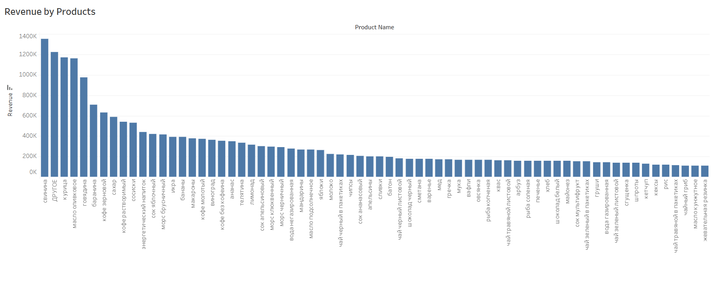

# Revenue Metrics Dashboard

This project uses data from the ["SQL simulator"](https://karpov.courses/simulator-sql).
The goal is to build a dashboard to track product metrics of a delivery service.
The database schema and tables' structure are described [here](database_structure.md)

## Tracked Metrics

The dashboard includes the following metrics:
1. Daily Revenue and Change of Daily Revenue by days; 
2. Total Revenue and Total Costs (cumulative values by days), calculated with different tax coefficients for multiple products;
3. Daily Gross Profit and Gross Profit Ratio:
4. Total Gross Profit and Total Gross Profit Ratio (cumulative values of daily metrics);
5. ARPPPU (Average Revenue per Paying User), ARPU (Average Revenue per User) and AOV (Average Order Value) dynamics by Days;
6. ARPPPU, ARPU and AOV distribution by Weekdays;
7. Running ARPPU, ARPU and AOV by Day (cumulative values by days);
8. Revenue from New Users (showing the share of revenue from new and existing users);
9. Revenue by Products.

## SQL Queries for Metric Calculations in PostgreSQL

<b>Metric 1</b>

```sql
SELECT *
    ,ROUND(100 * (revenue - lag(revenue) OVER (ORDER BY date)) / lag(revenue) OVER (ORDER BY date), 2) AS revenue_change
FROM
(
    SELECT date
        ,revenue
        ,SUM(revenue) OVER (ORDER BY date) AS total_revenue
    FROM
    (
        SELECT date
            ,SUM(price) AS revenue
        FROM
        (
            SELECT DATE(creation_time) AS date
                ,unnest(product_ids) AS product
            FROM orders
            WHERE order_id NOT IN (SELECT DISTINCT order_id FROM user_actions WHERE action = 'cancel_order')
        ) AS a
        JOIN products 
        ON a.product = products.product_id
        GROUP BY date
    ) AS a
) AS a
ORDER BY date
```

<b>Metrics 2 - 4</b>

```sql
WITH cost1 AS 
(
    SELECT date
        ,CASE WHEN DATE_TRUNC('month', date) = '2022-08-01' THEN 
            120000 + 140 * order_gether
            ELSE 150000 + 115 * order_gether
            END AS cost1
    FROM
    (
        SELECT DATE(creation_time) AS date
            ,COUNT(DISTINCT order_id) AS order_gether
        FROM orders 
        WHERE order_id NOT IN (SELECT DISTINCT order_id FROM user_actions WHERE action = 'cancel_order')
        GROUP BY date
    ) AS a
),

cost2 AS 
(
    SELECT date
        ,CASE WHEN DATE_TRUNC('month', date) = '2022-08-01' THEN 
                150 * SUM(orders_count) + 400 * COUNT(courier_id) FILTER (WHERE orders_count >= 5)
                ELSE 150 * SUM(orders_count) + 500 * COUNT(courier_id) FILTER (WHERE orders_count >= 5)
                END AS cost2
    FROM
    (
        SELECT DATE(time) AS date
            ,courier_id
            ,COUNT(DISTINCT order_id) AS orders_count
        FROM courier_actions
        WHERE action = 'deliver_order'
        GROUP BY date, courier_id
    ) AS a
    GROUP BY date
),

revenue AS
(
    SELECT date
        ,SUM(price) AS revenue
        ,SUM(ROUND(CASE WHEN 
            name IN ('сахар', 'сухарики', 'сушки', 'семечки', 
                    'масло льняное', 'виноград', 'масло оливковое', 
                    'арбуз', 'батон', 'йогурт', 'сливки', 'гречка', 
                    'овсянка', 'макароны', 'баранина', 'апельсины', 
                    'бублики', 'хлеб', 'горох', 'сметана', 'рыба копченая', 
                    'мука', 'шпроты', 'сосиски', 'свинина', 'рис', 
                    'масло кунжутное', 'сгущенка', 'ананас', 'говядина', 
                    'соль', 'рыба вяленая', 'масло подсолнечное', 'яблоки', 
                    'груши', 'лепешка', 'молоко', 'курица', 'лаваш', 'вафли', 'мандарины')
            THEN price * 0.1/(1 + 0.1) ELSE price * 0.2/(1 + 0.2) END, 2)) AS tax
    FROM
    (
        SELECT DATE(creation_time) AS date
            ,unnest(product_ids) AS product
        FROM orders
        WHERE order_id NOT IN (SELECT DISTINCT order_id FROM user_actions WHERE action = 'cancel_order')
    ) AS a
    JOIN products 
    ON a.product = products.product_id
    GROUP BY date
)

SELECT *
    ,SUM(revenue) OVER(ORDER BY date) AS total_revenue
    ,SUM(costs) OVER(ORDER BY date) AS total_costs
    ,SUM(tax) OVER(ORDER BY date) AS total_tax
    ,SUM(gross_profit) OVER(ORDER BY date)  AS total_gross_profit
    ,ROUND(100 * gross_profit / revenue::DECIMAL, 2) AS gross_profit_ratio
    ,ROUND(100 * (SUM(gross_profit) OVER(ORDER BY date)) / (SUM(revenue) OVER(ORDER BY date))::DECIMAL, 2) AS total_gross_profit_ratio
FROM
(
    SELECT revenue.date AS date
        ,revenue
        ,cost1 + cost2 AS costs
        ,tax
        ,revenue - (cost1 + cost2) - tax AS gross_profit
    FROM revenue
    JOIN cost1
    USING(date)
    JOIN cost2
    USING(date)
) AS a
ORDER BY date
```

<b>Metric 5</b>

```sql
WITH 
all_users AS 
(
    SELECT DATE_TRUNC('day', time) AS date
        ,COUNT(DISTINCT user_id) AS all_users_count
    FROM user_actions
    GROUP BY date
)

SELECT a.date AS date
    ,ROUND(revenue::DECIMAL / all_users_count, 2) AS ARPU
    ,ROUND(revenue::DECIMAL / paying_users, 2) AS ARPPU
    ,ROUND(revenue::DECIMAL / orders_count, 2) AS AOV
FROM
(
    SELECT date
        ,SUM(price) AS revenue
        ,COUNT(DISTINCT user_id) AS paying_users
        ,COUNT(DISTINCT order_id) AS orders_count
    FROM
    (
        SELECT DATE(creation_time) AS date
            ,orders.order_id AS order_id
            ,user_id
            ,unnest(product_ids) AS product
        FROM orders
        JOIN user_actions
        USING(order_id)
        WHERE order_id NOT IN (SELECT DISTINCT order_id FROM user_actions WHERE action = 'cancel_order')
    ) AS a
    JOIN products 
    ON a.product = products.product_id
    GROUP BY date
) AS a
LEFT JOIN all_users 
USING(date)
ORDER BY date
```

<b>Metric 6</b>

```sql
with 
revenue AS (
SELECT weekday_number, SUM(price) AS revenue,
       COUNT (DISTINCT order_id) AS orders
FROM (
      SELECT DATE_PART('isodow', creation_time)::INT AS weekday_number, order_id, unnest (product_ids) AS product_id
      FROM orders
      WHERE order_id NOT IN (SELECT order_id FROM user_actions WHERE action='cancel_order')
        AND creation_time >= '2022-08-26' AND creation_time < '2022-09-09') t
LEFT JOIN products USING (product_id)
GROUP BY weekday_number
),

users AS
(
SELECT DATE_PART('isodow', time)::INT AS weekday_number 
    ,to_char(min(time), 'Day') as weekday
    ,COUNT (DISTINCT user_id) FILTER (WHERE order_id NOT IN (SELECT order_id FROM user_actions WHERE action='cancel_order')) AS paying_users
    ,COUNT (DISTINCT user_id) AS all_users
FROM user_actions
WHERE time >= '2022-08-26' AND time < '2022-09-09'
GROUP BY weekday_number 
)

SELECT weekday,
    revenue.weekday_number AS weekday_number,
   ROUND (revenue::DECIMAL/all_users, 2) AS arpu,
   ROUND (revenue::DECIMAL/paying_users, 2) AS arppu,
   ROUND (revenue::DECIMAL/orders, 2) AS aov
FROM revenue LEFT JOIN users USING (weekday_number)
ORDER BY weekday_number
```

<b>Metric 7</b>

```sql
with 
revenue AS (
SELECT date, SUM(price) AS revenue,
       COUNT (DISTINCT order_id) AS orders
FROM (
      SELECT DATE (creation_time) AS date, order_id, unnest (product_ids) AS product_id
      FROM orders
      WHERE order_id NOT IN (SELECT order_id FROM user_actions WHERE action='cancel_order')) t
LEFT JOIN products USING (product_id)
GROUP BY date
),

users AS (
SELECT date, SUM (new_users) OVER (ORDER BY date) AS running_users,
       SUM (new_paying_users) OVER (ORDER BY date) AS running_paying_users
FROM (SELECT date, COUNT (DISTINCT user_id) AS new_paying_users
      FROM (SELECT user_id, MIN(time)::DATE as date
            FROM user_actions
            WHERE order_id NOT IN (SELECT order_id FROM user_actions WHERE action='cancel_order')
            GROUP BY user_id) t1
      GROUP BY date) t2
LEFT JOIN 
     (SELECT date, COUNT (user_id) as new_users
      FROM (SELECT user_id, MIN(time)::DATE as date
            FROM user_actions
            GROUP BY user_id) t3
      GROUP BY date) t4
USING (date)
)

SELECT date,
       ROUND (SUM (revenue) OVER (ORDER BY date)::DECIMAL/running_users, 2) AS running_arpu,
       ROUND (SUM (revenue) OVER (ORDER BY date)::DECIMAL/running_paying_users, 2) AS running_arppu,
       ROUND (SUM (revenue) OVER (ORDER BY date)::DECIMAL/SUM (orders) OVER (ORDER BY date ROWS UNBOUNDED PRECEDING), 2) AS running_aov
FROM revenue LEFT JOIN users USING (date)
ORDER BY date
```

<b>Metric 8</b>

```sql
SELECT *
    ,ROUND(100 * new_users_revenue::DECIMAL / revenue, 2) AS new_users_revenue_share
    ,ROUND(100 * (revenue - new_users_revenue)::DECIMAL / revenue, 2) AS old_users_revenue_share
FROM
(
    SELECT date
        ,SUM(price) FILTER (WHERE order_id NOT IN (SELECT DISTINCT order_id FROM user_actions WHERE action = 'cancel_order')) AS revenue
        ,SUM(price) FILTER (WHERE date = start_user 
                            AND order_id NOT IN (SELECT DISTINCT order_id FROM user_actions WHERE action = 'cancel_order')) AS new_users_revenue
    FROM
    (
        SELECT DATE(creation_time) AS date 
            ,orders.order_id AS order_id
            ,MIN(DATE(time)) OVER (PARTITION BY user_id) AS start_user
            ,unnest(product_ids) AS product
        FROM orders
        JOIN user_actions
        ON user_actions.order_id = orders.order_id
    ) AS a
    JOIN products 
    ON a.product = products.product_id
    GROUP BY date
) AS a
ORDER BY date
```

<b>Metric 9</b>

```sql
SELECT product_name
    ,SUM(a.revenue) AS revenue
    ,SUM(a.share_in_revenue) AS share_in_revenue
FROM
(
    SELECT CASE WHEN ROUND(100 * revenue::DECIMAL / SUM(revenue) OVER (), 2) < 0.5 THEN 'ДРУГОЕ' ELSE name END AS product_name
        ,revenue
        ,ROUND(100 * revenue::DECIMAL / SUM(revenue) OVER (), 2) AS share_in_revenue
    FROM
    (
        SELECT name
            ,SUM(price) AS revenue
        FROM
        (
            SELECT unnest(product_ids) AS product
            FROM orders
            WHERE order_id NOT IN (SELECT DISTINCT order_id FROM user_actions WHERE action = 'cancel_order')
        ) AS a
        JOIN products 
        ON a.product = products.product_id
        GROUP BY name
    ) AS a
) AS a
GROUP BY product_name
ORDER BY share_in_revenue DESC
```

## Tableau Dashboards
The metrics visualization contains 3 dashboards uploaded at Tableau Public:<br>
https://public.tableau.com/app/profile/alena.kniazeva/viz/Productmetricsofdeliveryservice/Dashboard1

<b>Dashboard 1</b>
<br />

<br />
<b>Dashboard 2</b>
<br />

<br />
<b>Dashboard 3</b>
<br />

<br />

## Conclusions
1. There was a significant decrease in revenue on the 5th and 6th of September. To identify the reason for this decrease, we should refer to [the dashboard with acquisition metrics](https://public.tableau.com/app/profile/alena.kniazeva/viz/Acquisitionmetricsofdeliveryservice/Dashboard). There, we see that a significant decrease in new users led to the drop in revenue on those days.
2. Revenue on weekends is slightly higher than on weekdays due to larger order count (this follows from the fact that revenue on weekends become higher while aov differs slightly).
3. The service is building a stable core audience, with existing users contributing to about half of all revenue by the end of the period.
4. The meat category generates the highest revenue of all the products delivered by the service.